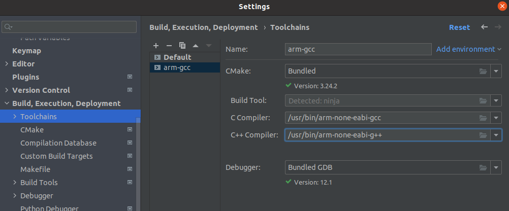

# STM32 Learning 
## IDE configuration

reference:

* [Mingw64+Clion+STM32](https://www.bilibili.com/read/cv6308000?spm_id_from=333.999.0.0)
* [Ubuntu+Clion+STM32](https://blog.csdn.net/qq_25014669/article/details/105692179)
* [Jetbrains Doc](https://www.jetbrains.com/help/clion/2022.3/embedded-development.html#new-project)

dependencies:

* `sudo apt install openocd`
* `sudo apt install gcc-arm-none-eabi`
* `STM32CubeMX`, I'm using the latest version now

configuration:

* In Clion, `Settings/Build, Execution, Development/Embedded Development`, fill the `OpenOCD` and `Stm32CubeMX Location`
* In Clion, `Settings/Build, Execution, Development/Toolchains`, add a new toolchain, edit its C Compiler and C++ Compiler

* In Clion or Cube, create a new project
* Skip the Board config file for OpenOCD(only for now)
* Wait for Clion to config
* Build

